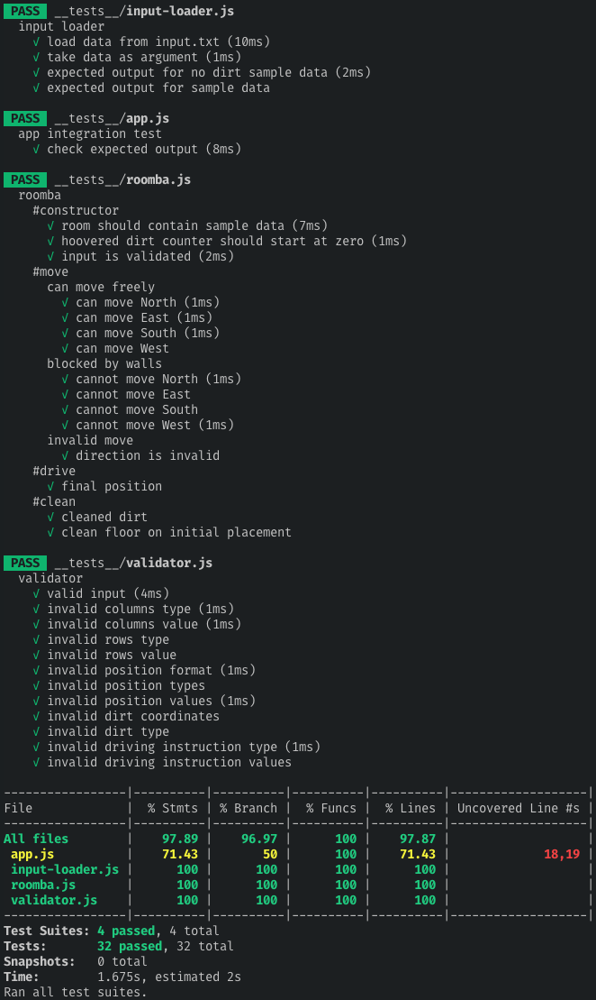

[](https://travis-ci.org/jonurry/roomba)
[](https://codecov.io/gh/jonurry/roomba)

# Roomba

Tech test for a junior javascript software engineer role

## Specification

Please see [SPEC.md](SPEC.md) for the problem specification

## Approach

I knew that I wanted to test-drive my solution so following a `test-driven development` approach was essential. I used the `red, green, refactor` TDD approach where you write a failing test, implement code to pass the test and then refactor to keep the code clean and as simple as possible.

I retained the domain language of the original requirements as much as possible. I strived for a simple, clean and high-quality solution.

- Preferring the simplest implementation rather than introducing unneeded complexity.

- Refactoring regularly to eliminate duplication and produce clean code.

- Aiming for a high-quality solution by catering for edge cases, decoupling code to improve maintainability and testability, encapsulating code to hide implementation details and ensuring that classes had a single responsibility.

## Design Decisions and Assumptions

### Common input data format

I decided on a common format for the input data and settled on JSON:

```json
{
  "columns": 5,
  "rows": 5,
  "position": { "x": 1, "y": 2 },
  "dirt": [{ "x": 1, "y": 0 }, { "x": 2, "y": 2 }, { "x": 2, "y": 3 }],
  "drivingInstructions": ["N", "N", "E", "S", "E", "E", "S", "W", "N", "W", "W"]
}
```

- **`columns`** - the number of columns or squares composing the x-dimension of the room's floor

- **`rows`** - the number of columns or squares composing the y-dimension of the room's floor

- **`position`** - an object representing the x and y coordinates of the current position of the roomba in the room

- **`dirt`** - an array containing objects representing the x and y coordinates of the position of dirt in the room

- **`drivingInstructions`** - an array of driving instructions e.g. 'N' instructs the roomba to move one square north

Having a common data format allows for easier testing, data sharing, validation and processing

### Classes

- **`Roomba`** - Represents the Roomba robotic hoover. Accepts an initial state as defined above in JSON format and a Validator that checks the initial state for errors

  - **`clean()`** - instructs the roomba to clean the current location in the room

  - **`drive()`** - instructs the roomba to follow the driving instructions, cleaning the room as it goes

  - **`move(direction)`** instructs the roomba to move one square in the given `direction`

- **`InputLoader`** - Reads the data from the `input.txt` file

  - **`output()`** parses the input data and converts it to the JSON format above ready to be passed to the Roomba

- **`Validator`** - Validates the format and content of the initial state of the Roomba. I tested for various edge cases. e.g. Wrong data types, values in correct range, restricted values and adherence to the coordinate object format.

  - **`check(data)`** validates the initial Roomba state `data`

- **`App`** - The application entry point. Once instantiated, it uses `InputLoader` to load the initial state from `input.txt`. Then it creates a `Roomba`, passes it the initial state (which is validated using `Validator`) and then instructs the `Roomba` to drive around the room following the driving instructions, cleaning as it goes.

  - **`output()`** Outputs (to the terminal) the `Roomba`'s final position in the room and the amount of dirt that it cleaned

I used dependency injection to decouple code and make it easier to test.

I used pure functions so that parameter values are not altered by functions.

I made use of `mocks` for testing so that each class could be tested in isolation from its dependencies.

I used Unix line feed (LF) characters when parsing the input file. This may not work on Windows where the use of CRLF is standard.

## Technologies Used

- `JavaScript` - The code had to be written in JavaScript as defined in the problem specification.

- `Node.js` - A standalone javascript runtime environment so that the code doesn't have to run in a browser.

- `Jest` - Testing framework. It's really powerful and I like using it.

- `ESLint` - For linting javascript syntax and ensuring that the code conforms to accepted style guidelines.

- `Babel` for transpiling the ES6+ JavaScript code to ES5 so that `node` and `jest` understands it.

- `Travis` - A continuous integration (CI) build server in the cloud that monitors the master branch of the code repository in GitHub and builds the code on every commit and runs all tests. The build status badge is at the top of this README.

- `Test Coverage` - All tests can be run with code coverage enabled. Data is gathered that measures how much of the code is tested. The stats can be viewed at [codecov.io](https://codecov.io/gh/jonurry/roomba) or in the terminal when running the tests locally.

- I also use `Prettier` in the `VS Code` IDE to ensure consistent code formatting

## Installation

The project requires `Node.js` to be installed on your computer. If you don't have node installed you can download and install it by following the instructions located [here](https://nodejs.org/en/download/)

To get the project code, please enter the following command in the terminal:

```
git clone git@github.com:jonurry/roomba.git
```

then, change to the newly created code directory:

```
cd roomba
```

To install the project dependencies, please enter the following command in the terminal:

```
npm install
```

## Lint

To lint the code with ESLint and check for code quality, please enter the following command in the terminal:

```
npm run lint
```

## Build

To transpile the code with Babel so that it can be executed in Node, please enter the following command in the terminal:

```
npm run build
```

## Run

To run the code in Node, please enter the following command in the terminal:

```
node ./lib/app.js
```

## Tests

To run all of the tests with code coverage (only once), please enter the following command in the terminal:

```
npm t
```

or

```
npm test
```

or, in watch mode

```
npm run test:watch
```

Test coverage is currently showing 97%. The only part of the code base that isn't covered is production only code that is explicitly excluded from the test environment. Here is the output from the latest test run:


